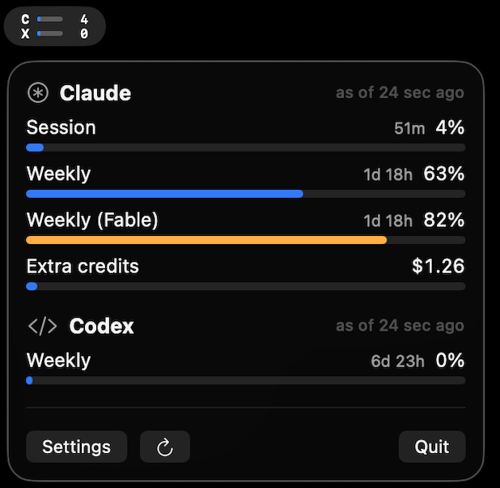

# tokmon

A macOS menu bar app that tracks AI provider usage limits at a glance:
Claude subscription session (5h), weekly, and extra-credit limits, plus
Codex/ChatGPT rate limits and remaining credits.

The menu bar title stacks one micro-row per provider (up to two): a glyph
(C = Claude, X = Codex), a tiny gauge bar, and the percent of that
provider's most-constrained rate-limit window, color-escalated (orange at
70%, red at 90%). Rows render as a composed image so color and two-line
layout survive the menu bar's template rendering; a dimmed row means the
value is cached from a degraded provider (stale or auth needed). Opening
the menu shows full per-provider gauges with reset countdowns.

<p align="center">
  
</p>

## Providers

- **Claude subscription** — session (5h), weekly, and model-scoped weekly
  limits, plus extra-usage credits. Reads Claude Code's OAuth credentials
  from the Keychain, falling back to oh-my-pi's credential store
  (`~/.omp/agent/agent.db`) when the Keychain token has expired unused
  (both read-only; tokmon never refreshes or writes tokens), and polls
  the same usage endpoint `/usage` reads, every 5 minutes.
- **Codex** — session/weekly rate limits and remaining credit balance,
  live from the same ChatGPT usage endpoint Codex's `/status` uses
  (read-only reuse of the CLI's OAuth token, with the same oh-my-pi
  fallback), polled every 5 minutes.
  Falls back to the rate-limit snapshots in `~/.codex/sessions`
  transcripts when the live call fails;
  fallback data is as fresh as your last Codex turn and the UI shows its
  actual age. See `docs/guides/codex-data-sources.md`.
- **Mocks** — two dev providers (disabled by default, toggleable in
  Settings) exercising every metric kind and the degraded/stale paths.

Usage is accounted server-side per account, so tokens consumed through
any harness on the same subscription (Claude Code, Codex CLI, oh-my-pi)
are all reflected in the same gauges.

Settings also cover per-provider enable/disable, the rate-limit bar shown
for each provider in the menu bar, and launch at login (a launchd agent
plist, since a bare SwiftPM executable can't use SMAppService).

## Build and run

Requires macOS 14+ and a Swift 6 toolchain (Xcode or CLT).

Install as an app (recommended — builds a release binary, wraps it in a
minimal ad-hoc-signed `tokmon.app`, installs to /Applications, launches):

```sh
./Scripts/install-app.sh
```

Re-run the script after code changes to update the installed app. For
quick development iteration without installing:

```sh
swift run
```

Create a distributable disk image locally with:

```sh
./Scripts/package-dmg.sh
```

The resulting `.build/tokmon.dmg` contains the app and an Applications
shortcut. The app is ad-hoc signed, not Developer ID signed or notarized,
so downloaded builds may require the usual macOS approval for an
unidentified developer.

GitHub Actions runs tests on pull requests. Every push to `main` packages
a DMG as a 14-day workflow artifact. Pushing a semantic version tag such
as `v0.2.0` packages the same DMG and creates a permanent GitHub Release
with generated release notes.

The app runs as a menu bar accessory (no Dock icon). Quit from the menu.
A single-instance guard in the bundled app prevents double-launching from
creating two menu bar widgets. State lives in
`~/Library/Application Support/tokmon/` (snapshot cache and settings,
both plain JSON).

## Architecture

Every provider maps its own data source (HTTP APIs, Keychain-sourced OAuth,
local files) into a small shared metric model, and the UI renders that model
blindly — one gauge component serves all providers, and adding a provider
means writing one fetcher, zero UI.

```
Sources/tokmon/
├── TokmonApp.swift        MenuBarExtra(.window), accessory activation
├── Core/
│   ├── Model.swift        UsageMetric / ProviderSnapshot / UsageProvider
│   ├── RefreshEngine.swift  actor: per-provider polling loops, exponential
│   │                        backoff, in-flight dedup, wake + network-restore
│   │                        refresh, refresh-on-menu-open (debounced)
│   ├── SnapshotCache.swift  last-known-good persisted; failures republish
│   │                        cached metrics under a degraded status so the
│   │                        widget never goes blank
│   ├── SettingsStore.swift  explicit JSON (no UserDefaults — bundle-ID-less)
│   ├── OmpCredentialStore.swift  read-only oh-my-pi token fallback (SQLite)
│   ├── ProviderRegistry.swift
│   └── AppState.swift     MainActor store + menu bar headline selection
├── UI/                    MetricGaugeRow is the single universal component
└── Providers/             one directory per provider
```

Model conventions: `.percent` metrics always have `limit: 100`; `limit: nil`
means an open-ended counter (rendered without a bar, never the headline);
countdowns are computed client-side from `resetsAt` so they stay correct
while data is stale.

## Adding a provider

Write one type conforming to `UsageProvider` (identity, refresh interval,
`fetchSnapshot()` mapping your data source into `UsageMetric`s), add it to
`ProviderRegistry.allProviders()`. The UI, refresh scheduling, caching, and
degraded-state handling come for free. Model conventions to respect: percent
metrics use `limit: 100`; `limit: nil` means an open-ended counter; throw
`ProviderError.authRequired(hint:)` for credential problems so cached gauges
stay visible with a hint.

## Future ideas

- OpenAI API spend provider
- Notifications on threshold crossing
- Historical charts / per-project cost breakdowns (Claude Code JSONL)
- App bundle + signing for distribution

## License

MIT — see [LICENSE](LICENSE).
